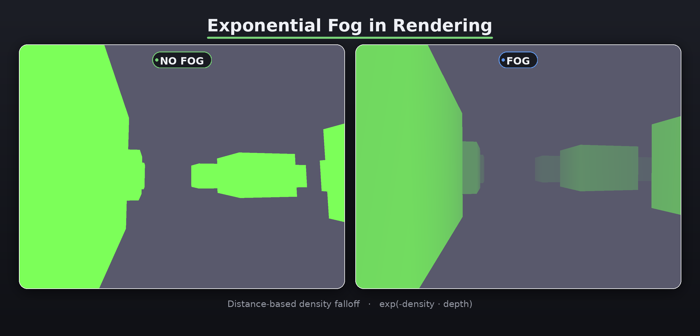

# Mad-RHI

A lightweight Rendering Hardware Interface (RHI) abstraction layer.

## Examples

Triangle

A minimal hello-world example. Renders colored triangle using a hardcoded vertex buffer and a basic vertex/fragment shader pipeline. Color changes with delta time.

Exponential Fog

Demonstrates depth-based exponential fog applied to a scene of cubes.

